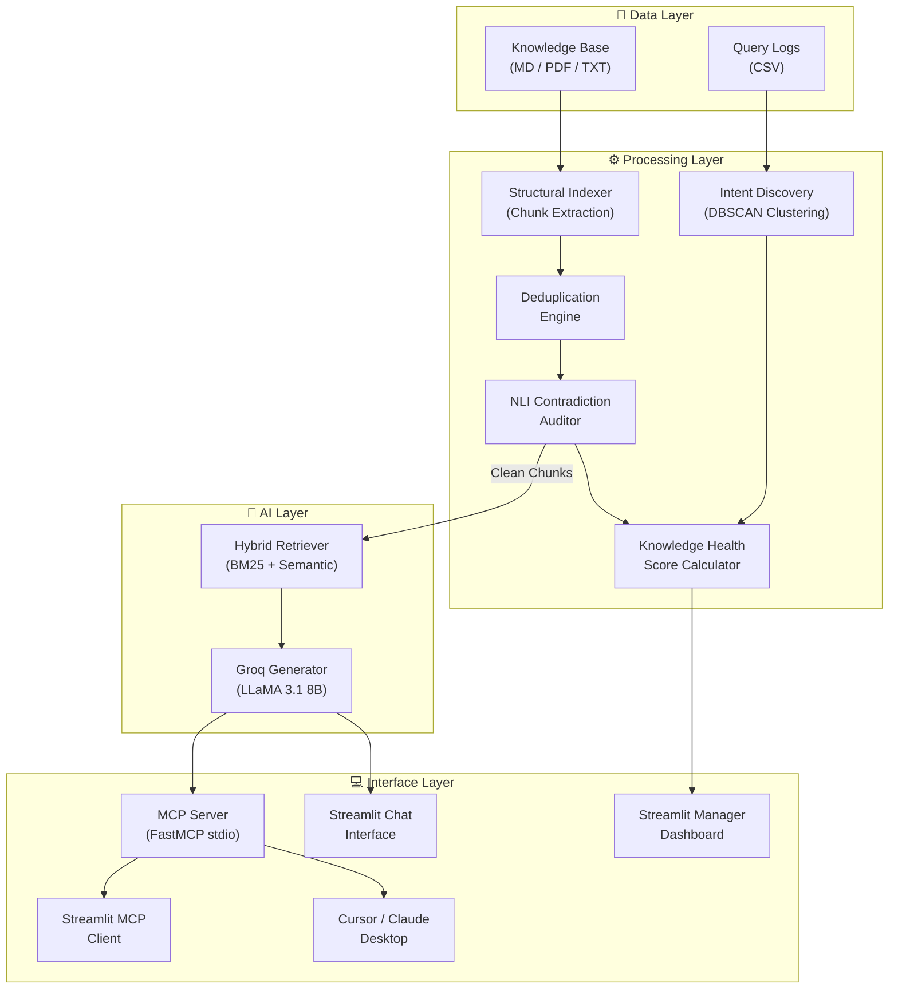

# Neurvinch

[](https://opensource.org/licenses/MIT)
[]()
[](https://streamlit.io)
[](https://modelcontextprotocol.io)
[](https://groq.com)
[](https://docs.ragas.io)

> An AI-driven **Knowledge Audit & Hybrid RAG** system that automatically cleans your dataset, eliminates contradictions, removes duplicates, and delivers **hallucination-free, grounded answers** — exposed as a full **MCP (Model Context Protocol) server** for AI clients like Cursor and Claude Desktop.

---

## 📑 Table of Contents

- [About the Project](#-about-the-project)
- [Features](#-features)
- [Tech Stack](#-tech-stack)
- [Architecture Overview](#-architecture-overview)
- [Getting Started](#-getting-started)
  - [Prerequisites](#prerequisites)
  - [Installation](#installation)
- [Usage](#-usage)
- [MCP Server](#-mcp-server)
- [Project Structure](#-project-structure)
- [Documentation](#-documentation)
- [Contributing](#-contributing)
- [License](#-license)
- [Contact](#-contact)

---

## 📖 About the Project

Enterprise knowledge bases suffer from a silent but critical problem: **contradictory, outdated, and duplicated information**. When AI assistants are trained or retrieve from such polluted data, they hallucinate — confidently giving wrong answers from stale policies, conflicting versions, or duplicated records.

**Neurvinch** solves this at the data layer before any LLM ever sees it:

1. **Ingest** documents (markdown, PDF, plain text) into structured chunks.
2. **Audit** — detect semantic contradictions and near-duplicates using NLI.
3. **Clean** — automatically resolve conflicts (newer version wins) and drop exact duplicates.
4. **Index** — fit a hybrid BM25 + semantic retriever *strictly* on the clean chunks.
5. **Answer** — generate grounded, cited, hallucination-free responses using Groq LLMs.
6. **Serve** — expose the entire pipeline as an MCP server for any AI client.

---

## ✨ Features

* **🧹 Automated Deduplication** — Detects and drops exact and near-exact duplicate chunks before retrieval.
* **⚔️ Contradiction Resolution** — NLI auditor finds conflicting knowledge; older versions are automatically deprecated.
* **🔍 Hybrid Retrieval** — BM25 sparse + TF-IDF/sentence-transformer semantic reranking for best-of-both-worlds relevance.
* **🤖 Groq-Powered Generation** — LLaMA 3.1 8B Instant produces fast, grounded, and cited responses.
* **📊 Knowledge Health Score** — A numerical measure of your knowledge base's integrity (0–1).
* **🔭 Documentation Void Discovery** — DBSCAN-based clustering over query logs surfaces topics your KB doesn't cover.
* **🔌 MCP Server** — Full Model Context Protocol server; use Cursor, Claude Desktop, or any AI client as a front-end.
* **💻 Streamlit Dashboards** — Ready-to-use Chat Interface + Manager Dashboard + MCP Streamlit Client.
* **📈 RAGAS Evaluation** — Built-in Retrieval-Augmented Generation Assessment metrics pipeline.
* **🛡️ Zero Hallucination Guarantee** — The retriever is fitted *only* on cleaned, verified chunks.

---

## 🛠 Tech Stack

| Layer | Technology |
|-------|------------|
| **Language** | Python 3.10+ |
| **Frontend** | Streamlit 1.41+ |
| **LLM Provider** | Groq (LLaMA 3.1 8B Instant) |
| **Embeddings** | TF-IDF (default) / sentence-transformers/all-MiniLM-L6-v2 |
| **NLI / Contradiction** | Heuristic (default) / cross-encoder/nli-deberta-v3-base |
| **Sparse Retrieval** | BM25 (rank-bm25) |
| **Document Parsing** | PyMuPDF (PDF), built-in markdown parser |
| **Clustering** | scikit-learn DBSCAN |
| **MCP Protocol** | `mcp>=1.2.0` (FastMCP) |
| **Evaluation** | RAGAS, datasets |
| **Config** | Pydantic-settings + python-dotenv |
| **Testing** | Python unittest |

---

## 🏗 Architecture Overview



---

## 🚀 Getting Started

### Prerequisites

- **Python 3.10+**
- **pip** (package manager)
- A free **Groq API key** — get one at [console.groq.com/keys](https://console.groq.com/keys)

### Installation

1. **Clone the repository:**
   ```bash
   git clone https://github.com/your-username/neurvinch_ragas.git
   cd neurvinch_ragas
   ```

2. **Create and activate a virtual environment:**
   ```bash
   python -m venv .venv
   # On Windows:
   .venv\Scripts\activate
   # On Mac/Linux:
   source .venv/bin/activate
   ```

3. **Install dependencies:**
   ```bash
   pip install -r requirements.txt
   ```

4. **Configure your environment:**
   ```bash
   copy .env.example .env   # Windows
   cp .env.example .env     # Mac/Linux
   ```
   Then open `.env` and set your Groq API key:
   ```env
   GROQ_API_KEY=your_api_key_here
   ```

---

## 📌 Usage

### 1. Run the Full Audit Pipeline
```bash
python run_pipeline.py
```
This indexes your knowledge base, detects contradictions, discovers documentation voids, and generates a knowledge health score in `outputs/report.json`.

### 2. Launch the Streamlit Chat Interface
```bash
python -m streamlit run app/chat_interface.py --server.port 8501
```
Open [http://localhost:8501](http://localhost:8501) — ask questions and get grounded AI answers.

### 3. Launch the Manager Dashboard
```bash
python -m streamlit run app/manager_dashboard.py --server.port 8502
```
Open [http://localhost:8502](http://localhost:8502) — view knowledge health metrics, contradiction alerts, and documentation voids.

### 4. Launch the Streamlit MCP Client
```bash
python -m streamlit run app/mcp_streamlit_client.py --server.port 8503
```
Open [http://localhost:8503](http://localhost:8503) — an interactive Streamlit frontend that communicates directly with the MCP server.

### 5. Verify the System
```bash
# Quick verification (config + retrieval check)
python verify_system.py

# Full verification (pipeline + benchmarks + tests + RAGAS eval)
python verify_system.py --full
```

---

## 🔌 MCP Server

Neurvinch exposes its entire dataset-cleaning and Q&A pipeline as a **Model Context Protocol (MCP) server**, making it compatible with any MCP-enabled AI client.

### Run the MCP Server
```bash
python -X utf8 run_mcp_server.py
```

### Test with MCP Inspector
```bash
npx -y @modelcontextprotocol/inspector python run_mcp_server.py
```

### Connect to Cursor
Add this to your Cursor MCP settings:
```json
{
  "name": "Neurvinch",
  "type": "stdio",
  "command": "python -X utf8 run_mcp_server.py"
}
```

### Connect to Claude Desktop
Add to `%APPDATA%\Claude\claude_desktop_config.json`:
```json
{
  "mcpServers": {
    "neurvinch": {
      "command": "python",
      "args": ["-X", "utf8", "c:\\path\\to\\neurvinch_ragas\\run_mcp_server.py"]
    }
  }
}
```

### Available MCP Tools

| Tool | Description |
|------|-------------|
| `set_knowledge_base_path(directory_path)` | Switch the active dataset folder dynamically |
| `upload_document(filename, content)` | Write a new file into the knowledge base |
| `clean_and_index_dataset()` | Deduplicate, resolve contradictions, fit retriever |
| `ask_grounded_question(query)` | Get a hallucination-free, cited answer |
| `get_cleaned_dataset_summary()` | View stats on the active clean index |

> 📘 Full MCP server documentation: [docs/mcp_server.md](docs/mcp_server.md)

---

## 📁 Project Structure

```
neurvinch_ragas/
├── app/                          # Streamlit user interfaces
│   ├── chat_interface.py         # AI-powered chat with grounded responses
│   ├── manager_dashboard.py      # Knowledge audit analytics dashboard
│   └── mcp_streamlit_client.py   # Streamlit as MCP client demo
├── src/neurvinch/                # Core Python package
│   ├── config.py                 # Pydantic settings (env vars)
│   ├── models.py                 # Pydantic data models
│   ├── embeddings.py             # TF-IDF / sentence-transformers backend
│   ├── generative.py             # Groq LLM response generation
│   ├── pipeline.py               # Full audit pipeline orchestrator
│   ├── mcp_server.py             # FastMCP server (tools + resources)
│   ├── indexing/                 # Document parsing & chunk extraction
│   ├── audit/                    # NLI contradiction detection
│   ├── intents/                  # Query-log clustering (void discovery)
│   ├── retrieval/                # Hybrid BM25 + semantic retriever
│   └── storage/                  # JSON artifact persistence
├── data/
│   ├── kb/                       # Your knowledge base files
│   ├── queries/query_logs.csv    # Historical query logs
│   └── eval/                     # Ground truth for benchmarking
├── outputs/                      # Generated audit artifacts
├── tests/                        # Regression test suite
├── notebooks/                    # Jupyter exploration notebooks
├── docs/                         # 📚 Detailed documentation
│   ├── folder_structure.md       # File & folder reference
│   ├── how_to_run.md             # Step-by-step run guide
│   ├── usecase.md                # Use cases & user journeys
│   ├── detail_description.md     # Deep technical description
│   ├── mcp_server.md             # MCP server reference
│   ├── architecture.md           # System architecture
│   └── api_reference.md          # Environment variables & API
├── run_pipeline.py               # Pipeline entry point
├── run_mcp_server.py             # MCP server runner
├── run_contradiction_benchmark.py
├── run_ragas_eval.py
├── verify_system.py              # End-to-end system verifier
├── requirements.txt
├── pyproject.toml
└── .env.example
```

---

## 📚 Documentation

All detailed documentation lives in the [`docs/`](docs/) folder:

| Document | Description |
|----------|-------------|
| [📁 folder_structure.md](docs/folder_structure.md) | Full file-by-file reference with module dependency diagram |
| [🚀 how_to_run.md](docs/how_to_run.md) | Step-by-step setup, running, and troubleshooting guide |
| [💡 usecase.md](docs/usecase.md) | Real-world use cases, user journeys, and scenario walkthroughs |
| [🔬 detail_description.md](docs/detail_description.md) | Deep technical breakdown of every component |
| [🔌 mcp_server.md](docs/mcp_server.md) | Complete MCP server API reference and client configuration |
| [🏗 architecture.md](docs/architecture.md) | System architecture, data flows, and technology decisions |
| [📋 api_reference.md](docs/api_reference.md) | All environment variables, models, and output artifacts |

---

## 🤝 Contributing

Contributions are welcome! Here's how to get started:

1. Fork the project
2. Create your feature branch: `git checkout -b feature/AmazingFeature`
3. Commit your changes: `git commit -m 'Add some AmazingFeature'`
4. Push to the branch: `git push origin feature/AmazingFeature`
5. Open a Pull Request

Please make sure all tests pass before submitting:
```bash
python -m unittest discover -s tests -p test_*.py
```

---

## 📄 License

Distributed under the MIT License. See `LICENSE` for more information.

---

## 📬 Contact

**Neurvinch Team**
- Project Repository: [github.com/your-username/neurvinch_ragas](https://github.com/your-username/neurvinch_ragas)
- Built for: Naan Mudhalvan Hackathon

---

<p align="center">Built with ❤️ to eliminate hallucinations from AI knowledge systems.</p>
