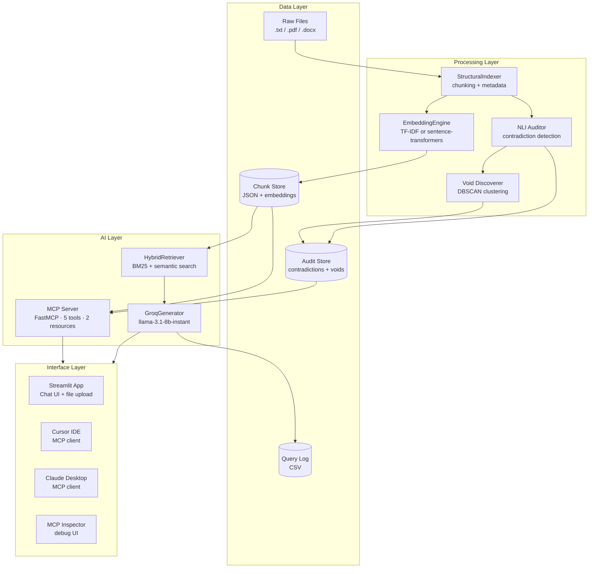
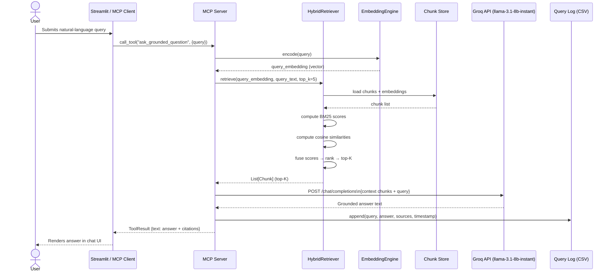

# System Architecture — Neurvinch AI RAG

## Table of Contents
1. [High-Level Overview](#high-level-overview)
2. [Architecture Diagram](#architecture-diagram)
3. [Component Breakdown](#component-breakdown)
4. [Data Flows](#data-flows)
   - [Ingestion Flow](#1-ingestion-flow)
   - [Audit Flow](#2-audit-flow)
   - [Query Flow](#3-query-flow)
5. [Query Flow Sequence Diagram](#query-flow-sequence-diagram)
6. [Technology Choices](#technology-choices)
7. [Scalability Considerations](#scalability-considerations)

---

## High-Level Overview

Neurvinch is a **self-auditing Retrieval-Augmented Generation (RAG)** system. Unlike vanilla RAG pipelines that simply retrieve and generate, Neurvinch adds an active quality layer: before any chunk enters the retrieval index it is audited for internal contradictions with other chunks, and topic "voids" (areas the corpus cannot answer) are surfaced proactively.

The result is a pipeline that is:
- **Trustworthy** — only semantically consistent chunks are retrieved.
- **Transparent** — every answer carries source citations, and audit reports are first-class outputs.
- **Composable** — the entire pipeline is exposed as an MCP server, making it usable by any AI client.

---

## Architecture Diagram



---

## Component Breakdown

| Component | Module | Responsibility |
|---|---|---|
| **StructuralIndexer** | `src/neurvinch/indexer.py` | Reads raw files, splits into overlapping chunks, attaches metadata (source, chunk index, char offset) |
| **NLI Auditor** | `src/neurvinch/auditor.py` | Pairwise contradiction detection between chunks using heuristic or cross-encoder NLI |
| **Void Discoverer** | `src/neurvinch/auditor.py` | DBSCAN clustering over chunk embeddings to find under-represented topic clusters |
| **EmbeddingEngine** | `src/neurvinch/embeddings.py` | Pluggable backend: TF-IDF (fast, no GPU) or `sentence-transformers` (higher quality) |
| **HybridRetriever** | `src/neurvinch/retriever.py` | BM25 lexical score + cosine semantic score fused by weighted sum |
| **GroqGenerator** | `src/neurvinch/generator.py` | Prompt assembly and Groq API call; enforces grounded-answer system prompt |
| **MCP Server** | `src/neurvinch/mcp_server.py` | FastMCP wrapper exposing all pipeline stages as typed tools and resources |
| **Streamlit App** | `app/mcp_streamlit_client.py` | Browser UI; acts as an MCP client spawning the server subprocess |
| **Config** | `src/neurvinch/config.py` | Pydantic `BaseSettings` reading all env vars with validated defaults |
| **CLI Scripts** | `run_mcp_server.py`, `run_query.py`, `run_indexer.py` | Entry points for server, one-shot query, and batch indexing |

---

## Data Flows

### 1. Ingestion Flow

```
User drops files into KB directory (or calls upload_document via MCP)
    │
    ▼
StructuralIndexer.index(kb_path)
    │  reads .txt / .pdf / .docx
    │  splits into chunks (default: 512 tokens, 64-token overlap)
    │  attaches: {source, chunk_index, char_start, char_end}
    ▼
EmbeddingEngine.encode(chunks)
    │  TF-IDF: fits vocab on corpus, transforms to sparse vectors
    │  sentence-transformers: encodes to 384-dim dense vectors
    ▼
Chunk Store (outputs/chunks.json)
    │  [{id, source, text, embedding}, ...]
    ▼
Ready for retrieval
```

**Key design decision**: Chunks are stored with their embeddings pre-computed so that retrieval is a pure in-memory operation with no re-encoding at query time.

---

### 2. Audit Flow

```
Chunk Store
    │
    ▼
NLI Auditor.audit(chunks)
    │
    ├─ Heuristic backend
    │    cosine_similarity(embed_i, embed_j) > CONTRADICTION_THRESHOLD
    │    → marks pair as contradictory
    │
    └─ Cross-encoder backend
         cross-encoder/nli-deberta-v3-base
         predicts {entailment, neutral, contradiction}
         → marks pair if P(contradiction) > threshold
    │
    ▼
Contradiction List → outputs/audit_report.json
    │
    ▼
Void Discoverer.discover(embeddings)
    │  DBSCAN(eps=DBSCAN_EPS, min_samples=DBSCAN_MIN_SAMPLES)
    │  Noise points = potential voids (under-covered topics)
    ▼
Void Cluster List → outputs/audit_report.json
    │
    ▼
Health Score = 100 × (1 - contradictions/total_pairs) × (1 - voids/expected_clusters)
```

The audit report is exposed as the `audit://report` MCP resource, allowing clients to inspect data quality without rerunning the pipeline.

---

### 3. Query Flow

```
User query (natural language)
    │
    ▼
EmbeddingEngine.encode(query)        ← same backend used during indexing
    │
    ▼
HybridRetriever.retrieve(query_embedding, query_text, top_k=5)
    │
    ├─ BM25Score(query_text, chunk_texts)  →  lexical_scores[i]
    │
    ├─ cosine_similarity(query_embedding, chunk_embeddings)  →  semantic_scores[i]
    │
    └─ hybrid_score[i] = α × lexical_scores[i] + (1−α) × semantic_scores[i]
         default α = 0.5
    │
    ▼
Top-K clean chunks (contradictory chunks are excluded from the index)
    │
    ▼
GroqGenerator.generate(query, chunks)
    │  System prompt: "Answer ONLY using the provided context. Cite sources."
    │  User message:  "[CONTEXT]\n{chunk texts}\n[QUESTION]\n{query}"
    │  model: llama-3.1-8b-instant  temperature: 0.7  max_tokens: 1024
    ▼
Grounded answer with source citations
    │
    ▼
Query logged to data/queries/query_logs.csv
```

---

## Query Flow Sequence Diagram



---

## Technology Choices

### TF-IDF vs. Sentence-Transformers

| Factor | TF-IDF (`tfidf`) | Sentence-Transformers (`sentence-transformers`) |
|---|---|---|
| **Speed** | ⚡ Near-instant (CPU) | 🐢 Slower (benefits from GPU) |
| **Memory** | Sparse matrices — very low | Dense 384-dim vectors — moderate |
| **Quality** | Good for exact keyword matching | Superior for semantic / paraphrase retrieval |
| **Dependencies** | `scikit-learn` only | `torch` + `transformers` + model download |
| **Best for** | Prototyping, CI, resource-constrained environments | Production, multi-lingual, paraphrase-heavy corpora |

**Default**: `tfidf` — allows the system to run entirely without a GPU and passes CI quickly.

---

### BM25 + Semantic Hybrid Retrieval

Pure semantic search can miss exact terminology (product codes, proper nouns). Pure BM25 misses paraphrases. The hybrid fuses both:

```
hybrid_score = 0.5 × bm25_score + 0.5 × cosine_similarity
```

The α weight is configurable. This simple linear fusion consistently outperforms either signal alone on domain-specific corpora.

---

### Groq (llama-3.1-8b-instant)

| Reason | Detail |
|---|---|
| **Speed** | Groq's LPU inference delivers ~750 tok/s — near-instant responses for chat |
| **Cost** | Free tier generous; 8B model is cheap even at scale |
| **Quality** | llama-3.1-8b-instant follows grounding instructions reliably |
| **No GPU needed** | All heavy inference offloaded to Groq's cloud |
| **Simple API** | OpenAI-compatible REST endpoint; easy to swap models |

The model name is configurable via `NEURVINCH_LLM_MODEL`, so upgrading to `llama-3.1-70b-versatile` or any Groq-hosted model requires only an env var change.

---

### FastMCP

FastMCP is a Python decorator-based framework for building MCP servers with minimal boilerplate:

```python
from mcp.server.fastmcp import FastMCP
mcp = FastMCP("neurvinch")

@mcp.tool()
def ask_grounded_question(query: str) -> str:
    ...
```

FastMCP handles:
- JSON Schema generation from Python type hints
- JSON-RPC 2.0 framing over stdio
- Tool and resource registration
- Error serialization into MCP-compliant error responses

This keeps the server code focused on domain logic rather than protocol plumbing.

---

### MCP as the Integration Layer

MCP was chosen over a REST API or gRPC because:
1. **No network configuration** — stdio transport works on any OS without firewall rules.
2. **Native AI client support** — Cursor, Claude Desktop, and others support MCP out of the box.
3. **Discoverable** — clients enumerate tools at runtime; no OpenAPI spec to maintain separately.
4. **Composable** — multiple MCP servers can be combined in a single AI assistant session.

---

## Scalability Considerations

| Dimension | Current Approach | Path to Scale |
|---|---|---|
| **Corpus size** | In-memory JSON store | Replace with a vector DB (Chroma, Qdrant, Weaviate) |
| **Embedding throughput** | Single-threaded encoding | Batch encoding + async workers |
| **Concurrency** | Single MCP server process | Run MCP server over SSE transport behind a load balancer |
| **LLM latency** | Groq cloud (~100 ms) | Add response streaming via MCP `progress` notifications |
| **Audit cost** | O(n²) pairwise comparison | ANN pre-filtering (HNSW) to reduce candidate pairs |
| **Multi-tenant** | Single KB directory | Namespace KB paths per user/organization |
| **Observability** | CSV query log | Export to OpenTelemetry → Grafana |
