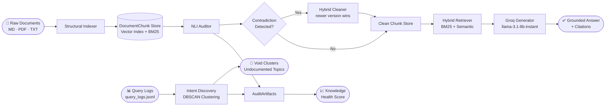
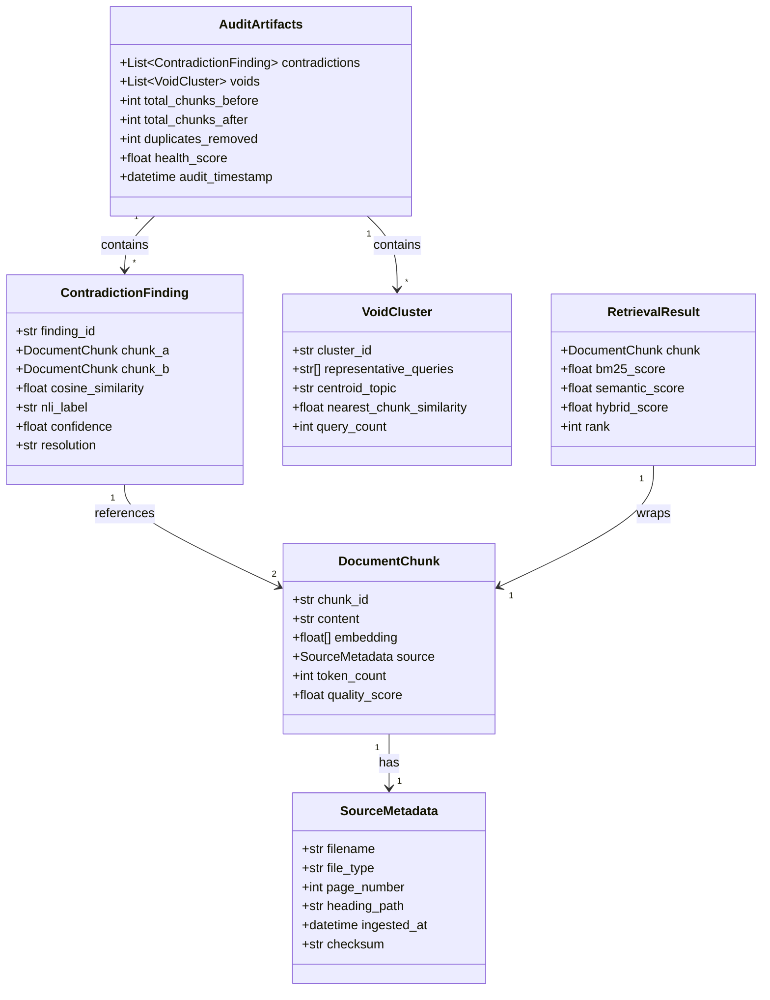
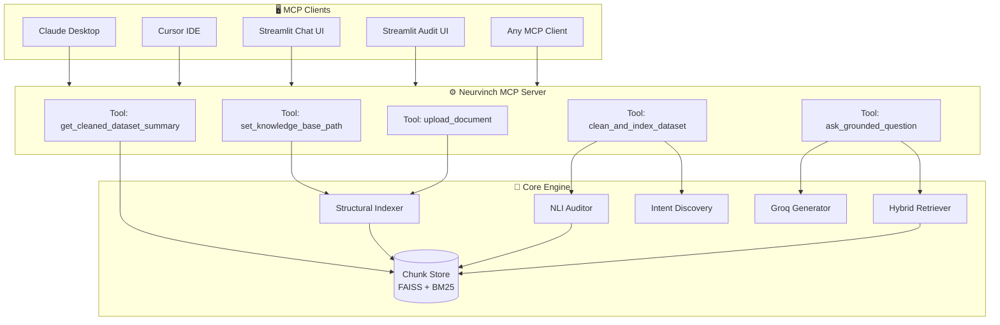

# Neurvinch — Deep Technical Description

> **AI-Driven Knowledge Audit & Hybrid RAG System**  
> Version 1.0 · Naanmudhalvan Hackathon Edition

---

## Table of Contents

1. [System Overview & Core Philosophy](#1-system-overview--core-philosophy)
2. [Full Data Pipeline](#2-full-data-pipeline)
3. [Pydantic Data Models](#3-pydantic-data-models)
4. [Structural Indexer](#4-structural-indexer)
5. [NLI Auditor](#5-nli-auditor)
6. [Hybrid Retriever](#6-hybrid-retriever)
7. [Intent Discovery — DBSCAN Void Detection](#7-intent-discovery--dbscan-void-detection)
8. [MCP Server Architecture](#8-mcp-server-architecture)
9. [Groq Generator](#9-groq-generator)
10. [RAGAS Evaluation Pipeline](#10-ragas-evaluation-pipeline)
11. [Knowledge Health Score](#11-knowledge-health-score)

---

## 1. System Overview & Core Philosophy

### The Hallucination Root Cause

Large Language Models hallucinate not because they are inherently unreliable, but because they are given **contradictory, redundant, or vacuous context**. When a RAG pipeline retrieves two chunks that say opposite things, the model must choose — and it often chooses incorrectly.

Neurvinch's core thesis is:

> **Hallucination elimination starts with data, not model prompting.**

Rather than patching LLM output with guardrails, Neurvinch **audits and cleans the knowledge base itself** before retrieval. A clean dataset means clean context, and clean context means grounded, verifiable answers.

### Design Pillars

| Pillar | Implementation |
|---|---|
| **Structural Awareness** | Documents are not naively chunked — headings, page boundaries, and paragraph structure drive chunk boundaries |
| **Contradiction-First Indexing** | NLI passes over the full chunk graph before any query is served |
| **Intent-Driven Gap Analysis** | Real user queries (not hypothetical ones) expose documentation voids |
| **Hybrid Retrieval** | Keyword recall (BM25) + semantic precision (sentence-transformers) gives best-of-both-worlds retrieval |
| **Open Protocol Integration** | MCP server means zero vendor lock-in; works with Claude, Cursor, Windsurf, and any future MCP client |

---

## 2. Full Data Pipeline



**Pipeline stages summary:**

| Stage | Input | Output | Key Parameter |
|---|---|---|---|
| Structural Indexer | Raw file bytes | `List[DocumentChunk]` | Chunk size, heading depth |
| NLI Auditor | `List[DocumentChunk]` | `List[ContradictionFinding]` | `contradiction_threshold = 0.85` |
| Hybrid Cleaner | Contradiction findings | Deduplicated chunk store | Newer timestamp wins |
| Intent Discovery | Query log file | `List[VoidCluster]` | `void_threshold = 0.35`, `eps = 0.4`, `min_samples = 8` |
| Hybrid Retriever | User query | `List[RetrievalResult]` | `top_k_candidates = 20`, `top_k_final = 5` |
| Groq Generator | Context chunks + query | Grounded answer string | Model: `llama-3.1-8b-instant` |

---

## 3. Pydantic Data Models

All inter-component communication uses strict Pydantic v2 models, enabling type safety, serialization, and MCP tool schema generation.



### Model Descriptions

**`SourceMetadata`**  
Tracks provenance of every chunk. `heading_path` stores the full Markdown heading hierarchy (e.g., `"Setup > Installation > Linux"`). `checksum` (SHA-256 of raw content) enables exact-duplicate detection before embedding.

**`DocumentChunk`**  
The atomic unit of the knowledge base. `quality_score` is set during ingestion (penalises very short or very long chunks). `embedding` is populated by the sentence-transformer model and cached to avoid recomputation.

**`ContradictionFinding`**  
Produced by the NLI Auditor. `resolution` records which chunk was kept after cleaning (`"kept_chunk_a"`, `"kept_chunk_b"`, or `"both_kept_neutral"`).

**`VoidCluster`**  
Represents a topic cluster from DBSCAN. `nearest_chunk_similarity` is the maximum cosine similarity between the cluster centroid and any chunk in the knowledge base — low values indicate genuine voids.

**`RetrievalResult`**  
Carries both the raw BM25 and semantic scores plus the fused `hybrid_score`. The hybrid score formula is:  
`hybrid_score = α × bm25_score_norm + (1 − α) × semantic_score`  
where `α = 0.4` by default.

**`AuditArtifacts`**  
The complete output of a single audit run, serializable to JSON and returned by the `get_cleaned_dataset_summary` MCP tool.

---

## 4. Structural Indexer

The Structural Indexer is the entry point for all raw documents. Its primary goal is to produce **semantically coherent chunks** that respect the logical structure of the source document.

### 4.1 Markdown Parser

Markdown files are parsed using a heading-aware recursive splitter:

1. The file is scanned for ATX-style headings (`#`, `##`, `###`, …).
2. Content is split at heading boundaries, preserving the heading text as the first line of each chunk.
3. The full heading hierarchy is stored in `SourceMetadata.heading_path` (e.g., `"API Reference > Endpoints > POST /query"`).
4. If a heading section exceeds `max_chunk_tokens` (default: 512), it is further split on double-newline paragraph boundaries.
5. Code blocks (```` ``` ```) are never split mid-block.

### 4.2 PDF Parser

PDF files are processed page-by-page using `pdfplumber` (or `PyMuPDF` as fallback):

1. Text is extracted per page with layout preservation.
2. Each page becomes at least one `DocumentChunk`.
3. Pages with fewer than `min_page_tokens = 30` tokens are merged with the next page (handles section break pages, blank pages, etc.).
4. `SourceMetadata.page_number` is set to the 1-indexed page number.
5. Tables are extracted as tab-separated text and treated as their own chunk with a `[TABLE]` prefix.

### 4.3 Plain-Text Parser

Text files use a sliding-window paragraph splitter:

1. Text is split on double-newline (`\n\n`) boundaries.
2. Paragraphs shorter than `min_chunk_tokens = 20` are merged with their successor.
3. Paragraphs longer than `max_chunk_tokens = 512` are split using spaCy sentence boundaries.

### 4.4 Embedding & Indexing

After parsing, all `DocumentChunk` objects are:

1. **SHA-256 deduplicated** — identical content checksums are dropped immediately.
2. **Embedded** using `sentence-transformers/all-MiniLM-L6-v2` (or configurable model).
3. **BM25 indexed** using `rank_bm25` with default `k1=1.5`, `b=0.75`.
4. Stored in an in-memory FAISS flat index for semantic retrieval.

---

## 5. NLI Auditor

The NLI Auditor identifies pairs of chunks that are semantically very similar yet make contradictory claims.

### 5.1 Candidate Pair Generation

Running full pairwise NLI over N chunks is O(N²). To make this tractable:

1. Cosine similarities are computed using the pre-computed embeddings (via FAISS inner product search).
2. Only pairs with `cosine_similarity ≥ contradiction_threshold (0.85)` are selected as candidates.
3. Self-pairs and same-document pairs (same `filename`) are excluded by default (configurable).

**Why 0.85?** Below this threshold, chunks are unlikely to be about the same specific claim. Above it, they are nearly semantically identical — the ideal zone for contradiction detection.

### 5.2 NLI Classification

For each candidate pair `(chunk_a, chunk_b)`:

**Heuristic Mode (fast, default for hackathon):**
- Antonym patterns and negation markers (`not`, `never`, `no longer`, `deprecated`) are checked.
- Numerical value disagreements (e.g., "16 GB RAM" vs "8 GB RAM") are detected via regex.
- Result: `ENTAILMENT` / `NEUTRAL` / `CONTRADICTION` with a rule-based confidence.

**Cross-Encoder Mode (production quality):**
- Uses `cross-encoder/nli-deberta-v3-small` or similar model.
- Input: `f"{chunk_a.content} [SEP] {chunk_b.content}"`.
- Softmax over three logits gives probability distribution over `ENTAILMENT`, `NEUTRAL`, `CONTRADICTION`.
- `nli_label` is the argmax label; `confidence` is its probability.

### 5.3 Contradiction Resolution

When a `CONTRADICTION` is found:

1. Compare `SourceMetadata.ingested_at` timestamps.
2. **Newer version wins** — the older chunk is removed from the index.
3. If timestamps are equal (same ingestion batch), both chunks are retained and flagged for human review.
4. Resolution is logged in `ContradictionFinding.resolution`.

---

## 6. Hybrid Retriever

### 6.1 BM25 Stage

Given a user query `q`:

1. Tokenise `q` using the same tokeniser as the BM25 index.
2. Score all chunks using `rank_bm25.BM25Okapi.get_scores(q_tokens)`.
3. Retrieve top `top_k_candidates = 20` by BM25 score.
4. Normalise scores to [0, 1] using min-max normalisation.

### 6.2 Semantic Stage

1. Embed `q` using the same sentence-transformer model used during indexing.
2. Perform FAISS approximate nearest-neighbour search.
3. Retrieve top `top_k_candidates = 20` by cosine similarity.
4. Normalise scores to [0, 1].

### 6.3 Score Fusion & Re-Ranking

The union of BM25 and semantic candidate sets is merged:

```
hybrid_score(chunk) = α × bm25_score_norm(chunk) + (1 − α) × semantic_score_norm(chunk)
```

Default `α = 0.4` (40% keyword, 60% semantic). The merged set is sorted by `hybrid_score` descending, and the top `top_k_final = 5` chunks are returned as `List[RetrievalResult]`.

**Why hybrid?**
- BM25 excels at exact-keyword matches (e.g., product names, error codes).
- Semantic retrieval excels at paraphrase and intent matching.
- Hybrid is consistently superior to either alone on mixed-domain corpora.

---

## 7. Intent Discovery — DBSCAN Void Detection

### 7.1 Query Embedding

Each historical query in `query_logs.jsonl` is embedded with the same sentence-transformer model. This produces a matrix `Q ∈ ℝ^{n × d}` where `n` is the number of logged queries and `d` is the embedding dimension.

### 7.2 DBSCAN Clustering

DBSCAN (Density-Based Spatial Clustering of Applications with Noise) is used instead of k-means because:
- The number of topic clusters is unknown a priori.
- DBSCAN naturally identifies noise (one-off queries) without forcing them into clusters.

Parameters:
- `eps = 0.4` — maximum cosine distance between two points to be considered neighbours.
- `min_samples = 8` — minimum queries required to form a dense region (cluster).

Clusters with fewer than `min_samples` queries are classified as noise and ignored.

### 7.3 Void Detection

For each cluster centroid `c_i`:

1. Compute `nearest_chunk_similarity = max(cosine_sim(c_i, chunk_j))` for all chunks `j` in the knowledge base.
2. If `nearest_chunk_similarity < void_threshold (0.35)`, the cluster is a **void** — users are asking about topics that have no corresponding documentation.
3. A `VoidCluster` object is created with the cluster's representative queries and centroid topic (derived from the most frequent n-gram in the cluster's queries).

---

## 8. MCP Server Architecture

Neurvinch exposes its capabilities via the **Model Context Protocol (MCP)**, enabling any MCP-compatible AI client to use the system without custom integration code.



### 8.1 Tool Specifications

#### `set_knowledge_base_path`

```python
@mcp.tool()
def set_knowledge_base_path(path: str) -> str:
    """
    Register a local directory as the knowledge base root.
    All subsequent uploads and scans will use this path.
    
    Args:
        path: Absolute or relative path to the knowledge base directory.
    Returns:
        Confirmation string with resolved absolute path.
    """
```

**Behaviour:** Validates path existence, creates the directory if it doesn't exist, stores path in session state.

---

#### `upload_document`

```python
@mcp.tool()
def upload_document(file_bytes: bytes, filename: str) -> dict:
    """
    Ingest a single document (MD, PDF, or TXT) into the knowledge base.
    
    Args:
        file_bytes: Raw bytes of the document.
        filename:   Original filename including extension.
    Returns:
        dict with keys: chunks_created, duplicates_skipped, file_type.
    """
```

**Behaviour:** Routes to the appropriate parser, deduplicates by SHA-256, updates BM25 and FAISS indices.

---

#### `clean_and_index_dataset`

```python
@mcp.tool()
def clean_and_index_dataset(query_log_path: str | None = None) -> AuditArtifacts:
    """
    Run the full audit pipeline: detect contradictions, resolve them,
    discover voids (if query log provided), compute health score.
    
    Args:
        query_log_path: Optional path to query_logs.jsonl for void detection.
    Returns:
        AuditArtifacts with full audit report.
    """
```

**Behaviour:** Sequential execution of NLI Auditor → Hybrid Cleaner → Intent Discovery (if log path provided) → Health Score computation.

---

#### `ask_grounded_question`

```python
@mcp.tool()
def ask_grounded_question(query: str, top_k: int = 5) -> dict:
    """
    Answer a natural language question using the audited knowledge base.
    
    Args:
        query:  The user's question.
        top_k:  Number of context chunks to retrieve (default: 5).
    Returns:
        dict with keys: answer, sources (List[str]), confidence.
    """
```

**Behaviour:** Hybrid retrieval → Groq generation with strict system prompt → return answer + source citations.

---

#### `get_cleaned_dataset_summary`

```python
@mcp.tool()
def get_cleaned_dataset_summary() -> AuditArtifacts:
    """
    Return the most recent AuditArtifacts without re-running the pipeline.
    
    Returns:
        AuditArtifacts serialized as dict (JSON-compatible).
    """
```

**Behaviour:** Returns cached `AuditArtifacts` from last `clean_and_index_dataset` call.

---

## 9. Groq Generator

### 9.1 Model Selection

Neurvinch uses **`llama-3.1-8b-instant`** via the Groq API for two reasons:
- **Speed:** Groq's LPU inference delivers sub-200ms first-token latency.
- **Context fidelity:** The 8B parameter Llama 3.1 model reliably follows strict grounding instructions.

### 9.2 System Prompt Design

The generator uses a strict grounding prompt:

```
You are a precise knowledge assistant. Answer ONLY using the provided context chunks.
If the answer is not present in the context, say exactly: "I don't have information about this in the knowledge base."
Do NOT infer, speculate, or use prior training knowledge.
Always cite the source document and page/section for each claim.
```

### 9.3 Context Construction

Retrieved chunks are formatted as:

```
[SOURCE 1] filename.md > Heading Path (Page N)
<chunk content>

[SOURCE 2] ...
```

The full context block is prepended to the user's query. Groq's API is called with `temperature=0.1` (near-deterministic for factual Q&A) and `max_tokens=1024`.

### 9.4 Citation Extraction

The model is instructed to reference `[SOURCE N]` in its answer. A post-processing step extracts cited source numbers and maps them back to `SourceMetadata` objects for the final `RetrievalResult` list.

---

## 10. RAGAS Evaluation Pipeline

Neurvinch integrates **RAGAS** (Retrieval Augmented Generation Assessment) for automated quality evaluation.

### 10.1 Metrics Computed

| Metric | What It Measures | Formula Basis |
|---|---|---|
| **Faithfulness** | Is every claim in the answer supported by retrieved context? | NLI between answer sentences and context |
| **Answer Relevancy** | Does the answer address the question? | Cosine similarity between question and answer embedding |
| **Context Precision** | Are the retrieved chunks relevant to the question? | Proportion of relevant chunks in top-k |
| **Context Recall** | Does the retrieved context contain all information needed? | Coverage of ground-truth answer by context |

### 10.2 Evaluation Flow

```
Test Questions (with ground truth)
        ↓
ask_grounded_question() × N
        ↓
Collect (question, context, answer, ground_truth) tuples
        ↓
ragas.evaluate(dataset, metrics=[faithfulness, answer_relevancy, context_precision, context_recall])
        ↓
DataFrame of per-question scores + aggregate mean
```

### 10.3 Evaluation Dataset Format

RAGAS expects a Hugging Face `Dataset` with columns:
- `question`: The test query.
- `answer`: The model's generated answer.
- `contexts`: List of retrieved chunk contents.
- `ground_truth`: The reference correct answer.

---

## 11. Knowledge Health Score

The Knowledge Health Score is a single scalar in `[0.0, 1.0]` that summarises the quality of the knowledge base.

### 11.1 Formula

```
score = 1.0 − (0.65 × contradiction_penalty + 0.35 × void_penalty)
```

### 11.2 Penalty Computation

**Contradiction Penalty:**

```
contradiction_rate = num_contradictions / max(total_chunks, 1)
contradiction_penalty = min(contradiction_rate × severity_weight, 1.0)
```

`severity_weight` scales by average NLI confidence of contradictions (higher confidence → higher penalty).

**Void Penalty:**

```
void_rate = num_void_clusters / max(total_query_clusters, 1)
void_penalty = min(void_rate, 1.0)
```

### 11.3 Weighting Rationale

The **65% weight on contradictions** vs **35% on voids** reflects that:
- Contradictions actively harm answer quality (LLM receives conflicting signals).
- Voids are a missed opportunity but don't degrade existing answers.

### 11.4 Score Interpretation

| Score Range | Interpretation | Recommended Action |
|---|---|---|
| `0.90 – 1.00` | 🟢 Excellent | Monitor; no immediate action needed |
| `0.75 – 0.89` | 🟡 Good | Address top 5 contradictions; fill top void clusters |
| `0.60 – 0.74` | 🟠 Fair | Run full contradiction resolution; prioritise void filling |
| `0.00 – 0.59` | 🔴 Poor | Significant knowledge base restructuring required |

---

*Document generated for Neurvinch v1.0 · Naanmudhalvan Hackathon 2025*
