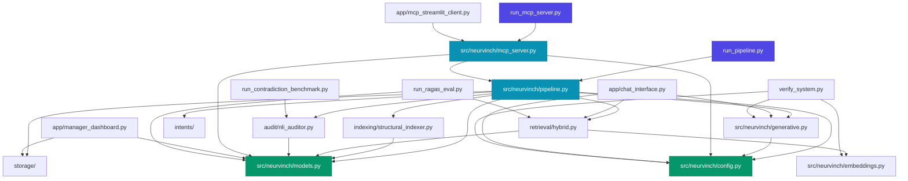
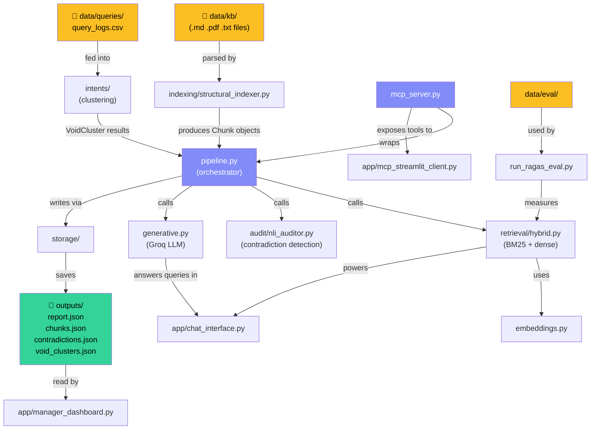

# 📁 Neurvinch Project — Folder & File Structure

> **Project:** `neurvinch_ragas` — AI-powered Knowledge Base Audit System  
> **Architecture:** Retrieval-Augmented Generation (RAG) + NLI Contradiction Detection + MCP Server

---

## 🗂️ Top-Level Overview

```
neurvinch_ragas/
├── .env / .env.example          ← Environment configuration
├── .gitignore
├── README.md                    ← Project overview
├── MCP_SERVER_DOCUMENTATION.md  ← MCP server API reference
├── pyproject.toml               ← Build/dependency metadata
├── requirements.txt             ← Python dependencies
├── run_pipeline.py              ← 🚀 Main pipeline entry point
├── run_mcp_server.py            ← MCP server runner
├── run_contradiction_benchmark.py
├── run_ragas_eval.py
├── verify_system.py
├── app/                         ← Streamlit UI applications
├── src/neurvinch/               ← Core library source code
├── data/                        ← Input data (KB, queries, eval)
├── outputs/                     ← Generated audit artifacts
├── notebooks/                   ← Jupyter notebooks
└── tests/                       ← Regression & unit tests
```

---

## 📄 File-by-File Reference Table

| File / Folder | Type | Purpose |
|---|---|---|
| `.env` | Config | Holds secrets: `GROQ_API_KEY`, model names, paths |
| `.env.example` | Config | Template for `.env` — commit-safe reference |
| `.gitignore` | Config | Excludes `outputs/`, `data/kb/`, `.env`, `__pycache__` |
| `README.md` | Docs | High-level overview, quickstart, architecture summary |
| `MCP_SERVER_DOCUMENTATION.md` | Docs | Full MCP tool/resource API reference |
| `pyproject.toml` | Build | PEP 517 build metadata, optional dev/test extras |
| `requirements.txt` | Build | Pinned runtime dependencies for reproducible installs |
| `run_pipeline.py` | Runner | **Main entry point** — orchestrates full audit pipeline end-to-end |
| `run_mcp_server.py` | Runner | Launches the FastMCP server over stdio/HTTP transport |
| `run_contradiction_benchmark.py` | Runner | Runs NLI contradiction benchmarks against labelled pairs |
| `run_ragas_eval.py` | Runner | Evaluates retrieval quality using RAGAS framework metrics |
| `verify_system.py` | Runner | System health check — verifies env, models, and data presence |

---

## 📁 `app/` — Streamlit User Interfaces

| File | Port | Purpose |
|---|---|---|
| `chat_interface.py` | 8501 | Interactive chat UI for querying the knowledge base via RAG |
| `manager_dashboard.py` | 8502 | Audit dashboard for reviewing contradictions, voids, and scores |
| `mcp_streamlit_client.py` | 8503 | Streamlit-based MCP client for invoking MCP tools interactively |

---

## 📁 `src/neurvinch/` — Core Library

### Root Module Files

| File | Purpose |
|---|---|
| `__init__.py` | Package initializer; exposes public API symbols |
| `config.py` | Pydantic `BaseSettings` model — loads `.env`, validates all config |
| `models.py` | Shared Pydantic data models: `Chunk`, `AuditReport`, `VoidCluster`, etc. |
| `embeddings.py` | Embedding backends: TF-IDF sparse vectors + sentence-transformers dense vectors |
| `generative.py` | Groq LLM client — prompt templates, streaming, answer generation |
| `pipeline.py` | **Top-level orchestrator** — wires indexing → retrieval → NLI → voids → report |
| `mcp_server.py` | FastMCP server definition — registers tools, resources, and prompts |

### `src/neurvinch/indexing/`

| File | Purpose |
|---|---|
| `structural_indexer.py` | Parses `.md`, `.pdf`, `.txt` KB files into semantic `Chunk` objects with metadata |

### `src/neurvinch/audit/`

| File | Purpose |
|---|---|
| `nli_auditor.py` | NLI-based contradiction detector — uses a transformer NLI model to flag conflicting chunks |

### `src/neurvinch/intents/`

| File | Purpose |
|---|---|
| *(modules)* | Query-log clustering pipeline — discovers "knowledge voids" from unanswered user queries |

### `src/neurvinch/retrieval/`

| File | Purpose |
|---|---|
| `hybrid.py` | Hybrid retriever combining BM25 (sparse) + sentence-transformer (dense) with RRF fusion |

### `src/neurvinch/storage/`

| File | Purpose |
|---|---|
| *(modules)* | JSON artifact persistence layer — saves/loads chunks, reports, contradictions, clusters |

---

## 📁 `data/` — Input Data

| Path | Purpose |
|---|---|
| `data/kb/` | Knowledge base source files (`.md`, `.pdf`, `.txt`) — indexed by `structural_indexer.py` |
| `data/queries/query_logs.csv` | Historical user query logs — used by intent clustering for void discovery |
| `data/eval/` | Ground-truth question-answer pairs for RAGAS evaluation |

---

## 📁 `outputs/` — Generated Audit Artifacts

| File | Purpose |
|---|---|
| `report.json` | Full structured audit report with scores and summary |
| `chunks.json` | All parsed and indexed chunks from the KB |
| `contradictions.json` | List of detected contradiction pairs with NLI scores |
| `void_clusters.json` | Clusters of unanswered query intents representing knowledge gaps |
| `cleaned_chunks.json` | MCP-processed output after applying AI-assisted cleaning suggestions |
| `eval/` | RAGAS evaluation output metrics and per-question results |

---

## 📁 `tests/` — Test Suite

| File | Purpose |
|---|---|
| `test_nli_auditor_regression.py` | Regression tests for NLI auditor — ensures consistent contradiction detection |
| `test_retrieval_regression.py` | Regression tests for hybrid retriever — validates recall and ranking stability |

---

## 🔗 Module Dependency Tree



---

## 🌊 Data Flow Between Folders



---

## 🏛️ Architectural Layers

| Layer | Folder/Files | Responsibility |
|---|---|---|
| **Configuration** | `config.py`, `.env` | Centralised settings, secret management |
| **Data Models** | `models.py` | Typed contracts between all components |
| **Ingestion** | `indexing/` | Parse raw KB files → structured chunks |
| **Retrieval** | `retrieval/`, `embeddings.py` | Find relevant chunks for queries |
| **Generation** | `generative.py` | Groq-powered answer synthesis |
| **Audit** | `audit/`, `intents/` | Detect contradictions & knowledge voids |
| **Orchestration** | `pipeline.py` | Wire all layers into a single workflow |
| **Persistence** | `storage/`, `outputs/` | Save and reload JSON artifacts |
| **API** | `mcp_server.py` | Expose pipeline capabilities via MCP protocol |
| **UI** | `app/` | Streamlit frontends for users and managers |
| **Evaluation** | `data/eval/`, `run_ragas_eval.py` | Measure retrieval quality |
| **Testing** | `tests/` | Regression safety net |
