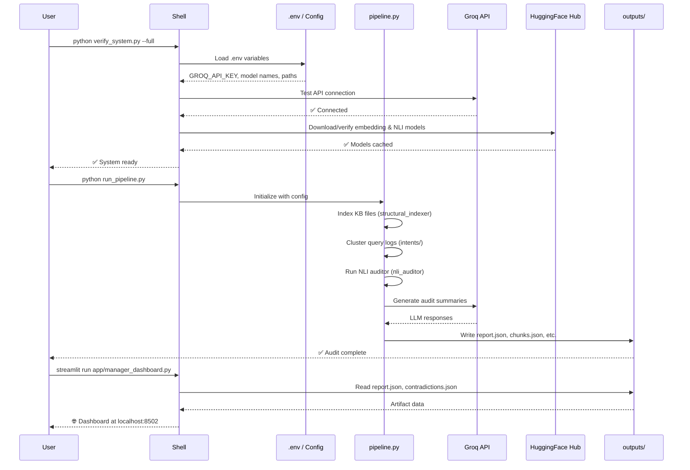
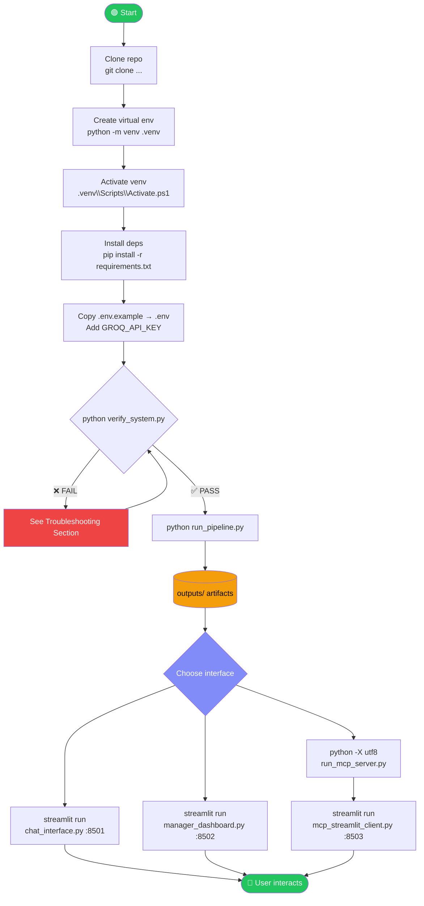

# 🚀 Neurvinch — How to Run

> **Complete guide** for setting up and running all components of the Neurvinch RAG Audit System on Windows.

---

## ✅ Prerequisites

| Requirement | Minimum Version | Check Command |
|---|---|---|
| Python | **3.10+** | `python --version` |
| pip | Latest | `pip --version` |
| Git | Any | `git --version` |
| Groq API Key | — | [console.groq.com](https://console.groq.com) |

> [!IMPORTANT]
> This project requires **Python 3.10 or higher** due to use of `match` statements, `typing` improvements, and modern `asyncio` patterns.

---

## 📦 Installation

### Step 1 — Clone the Repository

```bash
git clone https://github.com/your-org/neurvinch_ragas.git
cd neurvinch_ragas
```

### Step 2 — Create a Virtual Environment

```bash
# Windows PowerShell
python -m venv .venv
.venv\Scripts\Activate.ps1

# Windows CMD
python -m venv .venv
.venv\Scripts\activate.bat
```

> [!TIP]
> If PowerShell blocks script execution, run:
> ```powershell
> Set-ExecutionPolicy -ExecutionPolicy RemoteSigned -Scope CurrentUser
> ```

### Step 3 — Install Dependencies

```bash
pip install --upgrade pip
pip install -r requirements.txt
```

For development extras (testing, notebooks):

```bash
pip install -e ".[dev]"
```

---

## 🔑 Setting Up `.env`

### Step 4 — Copy the Example File

```bash
copy .env.example .env
```

### Step 5 — Edit `.env` with Your Credentials

Open `.env` in any text editor and fill in the required values:

```dotenv
# ── Required ──────────────────────────────────────────────────────────────────
GROQ_API_KEY=gsk_xxxxxxxxxxxxxxxxxxxxxxxxxxxxxxxxxxxxxxxxxxxx

# ── Model Configuration ───────────────────────────────────────────────────────
GROQ_MODEL=llama-3.3-70b-versatile
EMBEDDING_MODEL=all-MiniLM-L6-v2
NLI_MODEL=cross-encoder/nli-deberta-v3-small

# ── Path Configuration ────────────────────────────────────────────────────────
KB_DIR=data/kb
QUERY_LOG_PATH=data/queries/query_logs.csv
OUTPUT_DIR=outputs

# ── Pipeline Settings ─────────────────────────────────────────────────────────
CHUNK_SIZE=512
CHUNK_OVERLAP=64
TOP_K=5
```

> [!CAUTION]
> **Never commit `.env` to version control.** It is already listed in `.gitignore`.  
> Share secrets only via a secure secrets manager or direct handoff.

---

## ▶️ Running the Components

### 🔍 System Verification (Run First!)

Before running anything else, verify your environment is correctly set up:

```bash
# Quick health check
python verify_system.py

# Full verification (downloads models if missing)
python verify_system.py --full
```

Expected output:
```
✅ Environment variables loaded
✅ Groq API connection successful
✅ Embedding model loaded
✅ NLI model loaded
✅ Knowledge base directory found (N files)
✅ System ready
```

---

### 🏗️ Running the Audit Pipeline

```bash
python run_pipeline.py
```

This runs the **complete end-to-end audit** in sequence:
1. Indexes KB files from `data/kb/`
2. Clusters query logs from `data/queries/query_logs.csv`
3. Runs NLI contradiction detection across all chunk pairs
4. Generates the full audit report

**Output files** are written to `outputs/`:
- `outputs/report.json`
- `outputs/chunks.json`
- `outputs/contradictions.json`
- `outputs/void_clusters.json`

> [!NOTE]
> On first run, transformer models are downloaded from HuggingFace (~500 MB). Subsequent runs use the local cache.

---

### 🖥️ Running Streamlit Applications

Open **separate terminal windows** for each app. Activate the virtual environment in each terminal before running.

#### Chat Interface (Port 8501)

```bash
python -m streamlit run app/chat_interface.py --server.port 8501
```

Open: [http://localhost:8501](http://localhost:8501)

> Interactive RAG chat — ask questions about your knowledge base.

---

#### Manager Dashboard (Port 8502)

```bash
python -m streamlit run app/manager_dashboard.py --server.port 8502
```

Open: [http://localhost:8502](http://localhost:8502)

> Audit overview — review contradictions, void clusters, and quality scores.

> [!IMPORTANT]
> Run `python run_pipeline.py` **before** opening the dashboard so that `outputs/` contains the required JSON artifacts.

---

#### MCP Streamlit Client (Port 8503)

```bash
python -m streamlit run app/mcp_streamlit_client.py --server.port 8503
```

Open: [http://localhost:8503](http://localhost:8503)

> Interactive MCP tool explorer — invoke MCP tools and inspect results directly in the browser.

---

### 🔌 Running the MCP Server

```bash
python -X utf8 run_mcp_server.py
```

> [!NOTE]
> The `-X utf8` flag is **required on Windows** to ensure correct Unicode encoding over stdio transport. Without it, non-ASCII characters in JSON payloads may cause decoding errors.

The server exposes MCP tools including:
- `audit_knowledge_base` — run a full audit
- `search_chunks` — hybrid retrieval search
- `get_contradictions` — retrieve flagged contradiction pairs
- `get_void_clusters` — return knowledge gap clusters

---

### 🧪 Running Tests

```bash
python -m unittest discover -s tests -p "test_*.py"
```

To run a specific test file:

```bash
python -m unittest tests.test_nli_auditor_regression
python -m unittest tests.test_retrieval_regression
```

Expected output:
```
..........
----------------------------------------------------------------------
Ran 10 tests in 12.345s

OK
```

---

### 📊 Running Benchmarks

```bash
# NLI contradiction benchmark
python run_contradiction_benchmark.py

# RAGAS retrieval evaluation
python run_ragas_eval.py
```

Results are printed to stdout and optionally saved to `outputs/eval/`.

---

## 🗺️ Startup Sequence Diagram



---

## 🗺️ Full System Run Flowchart



---

## 🛠️ Troubleshooting — Windows-Specific Issues

### ❌ `UnicodeDecodeError` when running MCP server

**Symptom:** `UnicodeDecodeError: 'charmap' codec can't decode byte`

**Fix:** Always use the `-X utf8` flag:
```bash
python -X utf8 run_mcp_server.py
```

Or set the environment variable permanently in your shell profile:
```powershell
$env:PYTHONUTF8 = "1"
```

---

### ❌ PowerShell won't activate the virtual environment

**Symptom:** `cannot be loaded because running scripts is disabled on this system`

**Fix:**
```powershell
Set-ExecutionPolicy -ExecutionPolicy RemoteSigned -Scope CurrentUser
```

---

### ❌ `ModuleNotFoundError: No module named 'neurvinch'`

**Symptom:** Import errors when running scripts.

**Fix:** Ensure you are running from the project root and the venv is active. If using `pyproject.toml`, install in editable mode:
```bash
pip install -e .
```

---

### ❌ Streamlit port already in use

**Symptom:** `OSError: [Errno 10048] error while attempting to bind on address`

**Fix:** Kill the process using that port:
```powershell
netstat -ano | findstr :8501
taskkill /PID <PID> /F
```

Or choose a different port:
```bash
python -m streamlit run app/chat_interface.py --server.port 8510
```

---

### ❌ HuggingFace model download fails / hangs

**Symptom:** Long hang or `ConnectionError` during first run.

**Fix:**
1. Check your internet connection.
2. Set a custom cache directory:
   ```dotenv
   HF_HOME=C:\Users\<you>\.cache\huggingface
   ```
3. Use a mirror if needed:
   ```bash
   set HF_ENDPOINT=https://hf-mirror.com
   python run_pipeline.py
   ```

---

### ❌ Groq API returns 401 Unauthorized

**Symptom:** `AuthenticationError` or HTTP 401 from Groq.

**Fix:**
1. Verify your key at [console.groq.com](https://console.groq.com).
2. Ensure `.env` has `GROQ_API_KEY=gsk_...` with no extra spaces or quotes.
3. Confirm the venv was activated **after** editing `.env`.

---

### ❌ `outputs/` directory missing when opening dashboard

**Symptom:** Dashboard shows "file not found" for `report.json`.

**Fix:** Run the pipeline first to generate artifacts:
```bash
python run_pipeline.py
```

---

## 📋 Quick Reference Cheatsheet

```bash
# 1. Setup (run once)
python -m venv .venv && .venv\Scripts\Activate.ps1
pip install -r requirements.txt
copy .env.example .env   # then edit .env

# 2. Verify
python verify_system.py --full

# 3. Run pipeline
python run_pipeline.py

# 4. Launch UIs (separate terminals)
python -m streamlit run app/chat_interface.py --server.port 8501
python -m streamlit run app/manager_dashboard.py --server.port 8502
python -X utf8 run_mcp_server.py
python -m streamlit run app/mcp_streamlit_client.py --server.port 8503

# 5. Tests & benchmarks
python -m unittest discover -s tests -p "test_*.py"
python run_contradiction_benchmark.py
python run_ragas_eval.py
```
