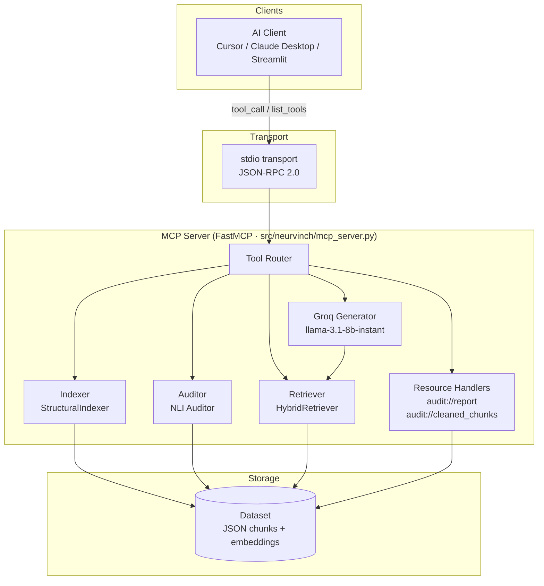
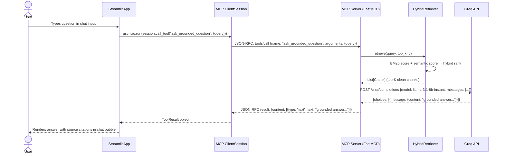

# MCP Server — Neurvinch AI RAG

## Table of Contents
1. [What is MCP?](#what-is-mcp)
2. [Server Architecture](#server-architecture)
3. [MCP Tools Reference](#mcp-tools-reference)
4. [MCP Resources](#mcp-resources)
5. [Running the Server](#running-the-server)
6. [Testing with MCP Inspector](#testing-with-mcp-inspector)
7. [Client Configuration](#client-configuration)
8. [Streamlit MCP Client](#streamlit-mcp-client)
9. [Full Interaction Sequence](#full-interaction-sequence)

---

## What is MCP?

**Model Context Protocol (MCP)** is an open standard that lets AI clients (IDEs, chat assistants, agents) connect to specialized tool-servers in a uniform way. Instead of embedding RAG logic directly inside a model's system prompt or a proprietary plugin, MCP exposes capabilities as a discoverable, typed API that any compliant client can call.

### Why Neurvinch Uses MCP

| Concern | Without MCP | With MCP |
|---|---|---|
| **Portability** | Logic is locked inside one app | Any MCP client (Cursor, Claude, custom) can call the same server |
| **Tool discovery** | Client must know the API upfront | Client discovers tools + schemas at runtime |
| **Structured I/O** | Free-form text parsing | Typed arguments with JSON Schema validation |
| **Separation of concerns** | UI and RAG logic tangled together | Clean boundary: UI talks JSON-RPC, server owns data |
| **Streaming** | Hard to implement consistently | MCP handles it natively via `stdio` / SSE transports |

The Neurvinch MCP server wraps the entire RAG pipeline — indexing, auditing, retrieval, and generation — behind five well-typed tools and two resources.

---

## Server Architecture



The server process is launched with `python -X utf8 run_mcp_server.py`, which starts an `asyncio` event loop and hands control to **FastMCP**. All communication with the client happens over `stdin` / `stdout` as newline-delimited JSON-RPC 2.0 messages — no TCP port is opened.

---

## MCP Tools Reference

### 1. `set_knowledge_base_path`

```
set_knowledge_base_path(directory_path: str) -> str
```

**Description**  
Sets the active knowledge-base directory for all subsequent operations. The path must be an existing directory on the local filesystem. After this call, the indexer, auditor, and retriever all resolve document paths relative to this root.

**Arguments**

| Argument | Type | Required | Description |
|---|---|---|---|
| `directory_path` | `str` | ✅ | Absolute or relative path to the KB directory |

**Behaviour**
- Validates that the path exists and is a directory.
- Stores the path in the server's session state.
- Does **not** re-index automatically; call `clean_and_index_dataset` after adding files.

**Return value**  
A confirmation string, e.g. `"Knowledge base path set to: data/kb"`, or an error message if the path is invalid.

---

### 2. `upload_document`

```
upload_document(filename: str, content: str) -> str
```

**Description**  
Writes a document into the active knowledge-base directory. Supports plain text or pre-extracted text from PDF/DOCX files. If the file already exists it is overwritten.

**Arguments**

| Argument | Type | Required | Description |
|---|---|---|---|
| `filename` | `str` | ✅ | Target filename including extension (e.g. `report.txt`) |
| `content` | `str` | ✅ | Full UTF-8 text content of the document |

**Behaviour**
1. Resolves the full path as `<kb_path>/<filename>`.
2. Creates parent directories if missing.
3. Writes the content with UTF-8 encoding.
4. Returns the absolute path of the saved file.

**Return value**  
`"Document uploaded successfully to: <full_path>"` or an error description.

---

### 3. `clean_and_index_dataset`

```
clean_and_index_dataset() -> str
```

**Description**  
Triggers the full three-stage cleaning and indexing pipeline over all documents in the active knowledge-base directory. This is the most compute-intensive tool; run it once after bulk uploads.

**Arguments**  
None.

**Three-stage cleaning pipeline**

```
Stage 1 — Structural Indexing
  └─ Reads all .txt / .pdf / .docx files in the KB directory
  └─ Splits each document into overlapping chunks (configurable size / stride)
  └─ Assigns metadata: source file, chunk index, character offset

Stage 2 — NLI Audit (contradiction & void detection)
  └─ Pairwise comparison of chunk embeddings (BM25 + semantic similarity)
  └─ Flags contradictory chunk pairs above NEURVINCH_CONTRADICTION_THRESHOLD
  └─ Identifies "void" clusters — topics with no supporting chunks (DBSCAN)
  └─ Computes a dataset Health Score (0–100)

Stage 3 — Embedding & Storage
  └─ Encodes clean chunks with the configured embedding backend (TF-IDF or sentence-transformers)
  └─ Persists chunks + embeddings to the output directory as JSON
  └─ Writes the audit report (JSON) and cleaned chunk list
```

**Return value**  
A multi-line summary string, e.g.:
```
Indexing complete.
  Total chunks  : 312
  Contradictions: 4
  Void clusters : 2
  Health score  : 87 / 100
  Output saved to: outputs/
```

---

### 4. `ask_grounded_question`

```
ask_grounded_question(query: str) -> str
```

**Description**  
Runs the full RAG query pipeline: hybrid retrieval → re-ranking → grounded generation. The answer is strictly grounded in the retrieved chunks — the LLM is instructed not to hallucinate facts outside the context window.

**Arguments**

| Argument | Type | Required | Description |
|---|---|---|---|
| `query` | `str` | ✅ | Natural-language question in any language |

**Behaviour**
1. Encodes the query with the same embedding backend used during indexing.
2. Runs BM25 + semantic search over the stored chunks (hybrid score).
3. Selects the top-K chunks (default K = 5, tunable via config).
4. Builds a prompt: `[CONTEXT]\n{chunks}\n[QUESTION]\n{query}`.
5. Calls Groq API (`llama-3.1-8b-instant`) with the prompt.
6. Returns the model's answer with inline source citations (`[Source: filename, chunk N]`).

**Return value**  
A grounded answer string with source citations appended.

---

### 5. `get_cleaned_dataset_summary`

```
get_cleaned_dataset_summary() -> str
```

**Description**  
Returns a human-readable summary of the last indexed dataset without re-running any computation. Reads the persisted audit report from disk.

**Arguments**  
None.

**Return value**  
A formatted summary string including:
- Total documents ingested
- Total clean chunks available
- Number of contradictions detected
- Number of void clusters
- Dataset Health Score
- Timestamp of last indexing run

---

## MCP Resources

MCP Resources are read-only data endpoints that clients can fetch at any time without triggering new computation.

### `audit://report`

| Property | Value |
|---|---|
| **URI** | `audit://report` |
| **MIME type** | `application/json` |
| **Description** | Full audit report produced by the last `clean_and_index_dataset` run |

**Payload structure**
```json
{
  "timestamp": "2025-01-15T10:30:00Z",
  "total_chunks": 312,
  "health_score": 87,
  "contradictions": [
    {
      "chunk_a_id": "doc1_chunk_3",
      "chunk_b_id": "doc2_chunk_11",
      "score": 0.91,
      "text_a": "...",
      "text_b": "..."
    }
  ],
  "void_clusters": [
    { "cluster_id": 0, "representative_text": "..." }
  ]
}
```

---

### `audit://cleaned_chunks`

| Property | Value |
|---|---|
| **URI** | `audit://cleaned_chunks` |
| **MIME type** | `application/json` |
| **Description** | List of all clean (non-contradictory) chunks with embeddings |

**Payload structure**
```json
[
  {
    "id": "doc1_chunk_0",
    "source": "report_q1.txt",
    "text": "Revenue grew 12% year-over-year ...",
    "embedding": [0.12, -0.34, ...]
  }
]
```

---

## Running the Server

> **Prerequisite**: Install dependencies with `pip install -e ".[dev]"` and set `GROQ_API_KEY` in your environment or `.env` file.

```bash
# Run with UTF-8 mode explicitly set (required on Windows)
python -X utf8 run_mcp_server.py
```

The server starts in stdio mode. You will not see a prompt — it is waiting for JSON-RPC messages on `stdin`. To interact, use an MCP client or the Inspector (see below).

To set a custom knowledge-base path at startup, configure `NEURVINCH_KB_PATH` in your `.env` before launching.

---

## Testing with MCP Inspector

MCP Inspector is an official browser-based UI for exploring any MCP server interactively.

```bash
npx -y @modelcontextprotocol/inspector python run_mcp_server.py
```

1. The command starts Inspector and opens `http://localhost:5173` in your browser.
2. You will see all five tools and two resources listed automatically.
3. Fill in arguments and click **Run** to invoke any tool.
4. Responses are displayed as formatted JSON.

> **Windows note**: Run from the project root so that relative paths (`data/kb`, `outputs/`) resolve correctly.

---

## Client Configuration

### Cursor IDE

Add the following to your Cursor MCP settings (`Cursor Settings → MCP → Edit config`):

```json
{
  "mcpServers": {
    "neurvinch": {
      "command": "python",
      "args": ["-X", "utf8", "run_mcp_server.py"],
      "cwd": "c:/Users/yuvar/Desktop/web_hoster/HACKATHONS--/naanmudhalvan/neurvinch_ragas",
      "env": {
        "GROQ_API_KEY": "<your-key-here>"
      }
    }
  }
}
```

After saving, restart Cursor. The Neurvinch tools will appear in the AI assistant's tool palette.

---

### Claude Desktop

Edit `%APPDATA%\Claude\claude_desktop_config.json`:

```json
{
  "mcpServers": {
    "neurvinch": {
      "command": "python",
      "args": ["-X", "utf8", "run_mcp_server.py"],
      "cwd": "c:\\Users\\yuvar\\Desktop\\web_hoster\\HACKATHONS--\\naanmudhalvan\\neurvinch_ragas",
      "env": {
        "GROQ_API_KEY": "<your-key-here>"
      }
    }
  }
}
```

Restart Claude Desktop. You will see a 🔌 icon indicating connected MCP tools. Claude can now call `ask_grounded_question`, upload documents, and retrieve audit data automatically during conversations.

---

## Streamlit MCP Client

`app/mcp_streamlit_client.py` is a purpose-built MCP client that provides a web UI without requiring an external AI assistant.

### How it Works

The Streamlit app uses the official Python MCP SDK's `stdio_client` context manager to **spawn the MCP server as a subprocess** and communicate over its stdin/stdout:

```python
from mcp import ClientSession, StdioServerParameters
from mcp.client.stdio import stdio_client

server_params = StdioServerParameters(
    command="python",
    args=["-X", "utf8", "run_mcp_server.py"],
    env={"GROQ_API_KEY": os.getenv("GROQ_API_KEY")},
)

async with stdio_client(server_params) as (read, write):
    async with ClientSession(read, write) as session:
        await session.initialize()
        result = await session.call_tool(
            "ask_grounded_question",
            arguments={"query": user_query}
        )
```

Key points:
- The server process is started fresh each Streamlit session and killed on disconnect.
- `ClientSession.initialize()` triggers the MCP handshake and capability negotiation.
- Tool calls are fully async; Streamlit uses `asyncio.run()` to bridge sync and async contexts.
- File uploads use the `upload_document` tool directly — no separate REST endpoint needed.

---

## Full Interaction Sequence


