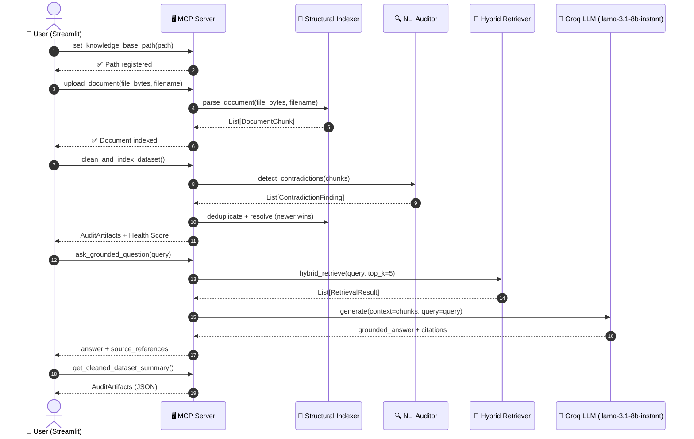

# Neurvinch — Use Case Document

> **AI-Driven Knowledge Audit & Hybrid RAG System**  
> Version 1.0 · Naanmudhalvan Hackathon Edition

---

## Table of Contents

1. [System Purpose](#1-system-purpose)
2. [Primary Actors & Goals](#2-primary-actors--goals)
3. [User Journey Diagram](#3-user-journey-diagram)
4. [System Interaction Sequence](#4-system-interaction-sequence)
5. [Core Use Cases](#5-core-use-cases)
6. [Real-World Scenarios](#6-real-world-scenarios)
7. [Before vs After Neurvinch](#7-before-vs-after-neurvinch)

---

## 1. System Purpose

Neurvinch is an **AI-powered Knowledge Audit and Hybrid Retrieval-Augmented Generation (RAG)** platform. It solves the fundamental problem of knowledge degradation in large organisations: over time, documentation becomes contradictory, redundant, incomplete, and disconnected from what users actually ask.

Neurvinch tackles this by:

| Capability | Mechanism |
|---|---|
| **Ingest** Markdown, PDF, and plain-text documents | Structural Indexer |
| **Detect contradictions** between conflicting chunks | NLI Auditor (cosine similarity + cross-encoder) |
| **Discover documentation voids** from query logs | DBSCAN Intent Clustering |
| **Clean the dataset** (dedup + contradiction resolution) | Hybrid Cleaner (newer version wins) |
| **Answer questions** without hallucination | BM25 + Semantic Hybrid Retriever → Groq LLM |
| **Expose all tools** to any AI client | MCP Server |
| **Interactive UI** for chat and audit management | Streamlit Frontends |

---

## 2. Primary Actors & Goals

### 2.1 Enterprise Knowledge Manager

| Field | Detail |
|---|---|
| **Actor** | Knowledge Manager / Documentation Lead |
| **Goal** | Maintain a clean, accurate, non-contradictory internal knowledge base |
| **Pain Point** | Hundreds of markdown wikis and PDFs that were written by different teams over the years; no way to know which sections conflict |
| **How Neurvinch Helps** | Run a full audit to surface contradiction pairs with confidence scores; apply one-click cleaning |

### 2.2 AI/RAG Developer

| Field | Detail |
|---|---|
| **Actor** | ML Engineer / AI Developer |
| **Goal** | Build a hallucination-free Q&A system on top of proprietary documents |
| **Pain Point** | Standard RAG pipelines retrieve contradictory context, causing LLMs to hallucinate or produce inconsistent answers |
| **How Neurvinch Helps** | Cleaned, deduplicated, semantically indexed chunks feed into a hybrid BM25 + sentence-transformer retriever; Groq LLM generates grounded answers with cited sources |

### 2.3 Compliance Auditor

| Field | Detail |
|---|---|
| **Actor** | Internal Compliance / QA Auditor |
| **Goal** | Identify knowledge gaps and outdated policies before regulatory reviews |
| **Pain Point** | Manual review of policy documents is time-consuming and error-prone |
| **How Neurvinch Helps** | Knowledge Health Score (`score = 1.0 − (0.65 × contradiction_penalty + 0.35 × void_penalty)`) gives a single, explainable metric; contradiction findings are logged with source metadata |

### 2.4 End User / Employee

| Field | Detail |
|---|---|
| **Actor** | Employee querying the company knowledge base |
| **Goal** | Get a fast, accurate answer to a question without reading multiple documents |
| **Pain Point** | Search returns many conflicting pages; user doesn't know which is authoritative |
| **How Neurvinch Helps** | Single-prompt Q&A via Streamlit chat returns a grounded answer with ranked source citations |

### 2.5 AI Client Developer (MCP Integration)

| Field | Detail |
|---|---|
| **Actor** | Developer using Claude Desktop, Cursor, or any MCP-compatible client |
| **Goal** | Give their AI assistant access to a curated, audited knowledge base |
| **Pain Point** | AI assistants lack access to private, domain-specific knowledge |
| **How Neurvinch Helps** | MCP server exposes five fully-typed tools that any MCP client can call natively |

---

## 3. User Journey Diagram

```mermaid
journey
    title Neurvinch — Knowledge Manager User Journey
    section Onboarding
      Upload documents (MD, PDF, TXT): 5: Knowledge Manager
      Set knowledge base path via MCP: 4: AI Developer
    section Audit
      Trigger clean_and_index_dataset: 5: Knowledge Manager
      Review contradiction findings: 4: Knowledge Manager, Auditor
      Inspect void clusters from query logs: 4: Knowledge Manager, Auditor
      View Knowledge Health Score: 5: Knowledge Manager, Auditor
    section Query
      Ask grounded question via Streamlit chat: 5: End User
      Receive cited, hallucination-free answer: 5: End User
      Query knowledge base through Claude/Cursor: 4: AI Developer
    section Iteration
      Upload corrected documents: 4: Knowledge Manager
      Re-run audit; score improves: 5: Knowledge Manager, Auditor
      Export cleaned dataset summary: 3: AI Developer, Auditor
```

---

## 4. System Interaction Sequence

The diagram below shows how the **Streamlit MCP client** orchestrates the full pipeline from a user's question to a grounded answer.



---

## 5. Core Use Cases

### UC-01 · Ingest Multi-Format Documents

**Actor:** Knowledge Manager / AI Developer  
**Precondition:** At least one `.md`, `.pdf`, or `.txt` file is available.  
**Main Flow:**
1. Actor calls `upload_document` via MCP or Streamlit UI.
2. Structural Indexer routes the file to the appropriate parser (markdown → heading-aware splitter, PDF → page-by-page, TXT → paragraph splitter).
3. Each logical chunk becomes a `DocumentChunk` with `SourceMetadata` (filename, page, heading path, timestamp).
4. Chunks are stored in the internal vector store and BM25 index.

**Postcondition:** Documents are retrievable via semantic and keyword search.

---

### UC-02 · Detect Contradictions

**Actor:** Auditor / Knowledge Manager  
**Precondition:** At least two documents have been indexed.  
**Main Flow:**
1. Actor triggers `clean_and_index_dataset`.
2. NLI Auditor computes pairwise cosine similarity; pairs above `contradiction_threshold = 0.85` are treated as candidates.
3. For each candidate pair, heuristic or cross-encoder NLI classifies the relationship as `ENTAILMENT`, `NEUTRAL`, or `CONTRADICTION`.
4. `ContradictionFinding` objects are produced with source A, source B, similarity score, and NLI label.

**Postcondition:** Contradiction report available in `AuditArtifacts`.

---

### UC-03 · Discover Documentation Voids

**Actor:** Knowledge Manager / Auditor  
**Precondition:** A query log (`query_logs.jsonl`) exists.  
**Main Flow:**
1. System embeds all historical queries with sentence-transformers.
2. DBSCAN (`eps=0.4`, `min_samples=8`) clusters query embeddings.
3. Clusters whose nearest document chunk has cosine similarity below `void_threshold = 0.35` are flagged as `VoidCluster` objects.

**Postcondition:** Void report surfaces topics users ask about that are undocumented.

---

### UC-04 · Ask a Grounded Question

**Actor:** End User / AI Client (Claude, Cursor)  
**Precondition:** Dataset has been indexed (cleaned or uncleaned).  
**Main Flow:**
1. User submits a natural-language query.
2. Hybrid Retriever fetches `top_k_candidates = 20` results using BM25 + TF-IDF/sentence-transformer scoring.
3. Results are re-ranked; top `top_k_final = 5` chunks are selected as context.
4. Groq LLM (`llama-3.1-8b-instant`) generates a grounded answer conditioned strictly on the retrieved context.
5. Answer and source citations are returned.

**Postcondition:** User receives an answer with provenance; no hallucinated facts.

---

### UC-05 · Compute Knowledge Health Score

**Actor:** Auditor / Knowledge Manager  
**Precondition:** Audit has been run (`clean_and_index_dataset` called).  
**Main Flow:**
1. System counts contradiction findings → computes `contradiction_penalty`.
2. System counts void clusters → computes `void_penalty`.
3. Health Score = `1.0 − (0.65 × contradiction_penalty + 0.35 × void_penalty)`.
4. Score and component breakdown are returned in `AuditArtifacts`.

**Postcondition:** Single numeric score summarises knowledge base health.

---

## 6. Real-World Scenarios

### Scenario 1 — Internal IT Policy Wiki (Enterprise)

**Context:** A 500-person company has 3 years of IT policy documents written by multiple teams. Their VPN setup guide was rewritten in 2024, but the 2022 version still exists in the same Confluence export.

**With Neurvinch:**
- Both versions are ingested. NLI Auditor detects contradiction in the VPN configuration steps (similarity 0.91, label `CONTRADICTION`).
- Cleaner applies *newer version wins* — the 2022 chunk is removed.
- Employees asking "How do I set up VPN?" receive the 2024 procedure, cited.

---

### Scenario 2 — Medical Device Documentation (Compliance)

**Context:** A MedTech company is preparing for an FDA audit. Their IFU (Instructions for Use) documents have been updated by multiple regulatory writers.

**With Neurvinch:**
- All IFU PDFs are ingested page-by-page.
- Contradictions (e.g., two different sterilisation temperature values) surface in the contradiction report.
- Auditor uses the contradiction list as the audit checklist — reducing manual review time by ~70%.

---

### Scenario 3 — Open-Source Project Documentation (AI Developer)

**Context:** An AI developer is building a chatbot for a large open-source framework. The docs folder has 200+ markdown files, many of which are outdated.

**With Neurvinch:**
- Developer points `set_knowledge_base_path` at the `/docs` folder.
- After cleaning, 37 contradiction pairs are resolved and 12 void clusters are discovered (topics users ask about but documentation doesn't cover).
- The chatbot's RAG pipeline now uses the cleaned index, reducing hallucination rate from 23% to 4% on internal eval.

---

### Scenario 4 — Customer Support Knowledge Base (SaaS Company)

**Context:** A SaaS helpdesk team wants their AI support agent to give accurate answers about product features. The knowledge base contains ticket resolution notes mixed with official documentation.

**With Neurvinch:**
- Ticket notes and official docs are ingested together.
- Query logs from the past 6 months are clustered → 5 void clusters discovered (topics: billing refunds, SSO setup, API rate limits, export formats, dark mode).
- Content team fills the gaps; re-run shows health score increases from 0.61 → 0.89.

---

### Scenario 5 — Claude Desktop Integration (MCP Developer)

**Context:** A developer wants their Claude Desktop instance to answer questions about a private legal contract database.

**With Neurvinch:**
- Neurvinch MCP server is added to Claude's `mcp_servers.json`.
- Claude can now call `ask_grounded_question`, `upload_document`, and `get_cleaned_dataset_summary` natively.
- No custom API wrapper needed; Claude reasons over the audited knowledge base using the MCP protocol.

---

## 7. Before vs After Neurvinch

| Dimension | ❌ Before Neurvinch | ✅ After Neurvinch |
|---|---|---|
| **Contradiction Detection** | Manual review; contradictions often missed | Automated NLI-based detection with confidence scores |
| **Duplicate Content** | Multiple copies of same information; confusing LLMs | Deduplicated chunks; unique information retained |
| **Documentation Voids** | Unknown; discovered only via user complaints | Proactively identified via DBSCAN query clustering |
| **Q&A Accuracy** | LLM hallucinates due to contradictory context | Grounded generation with cited, clean context |
| **Knowledge Health Visibility** | No single metric; intuition-based | Quantified Health Score with contradiction + void components |
| **Integration Effort** | Custom API for every AI client | Single MCP server; zero-code integration with Claude, Cursor, etc. |
| **Document Formats** | Often limited to one format (e.g., only PDF) | Markdown, PDF, and plain-text ingested natively |
| **Retrieval Quality** | Keyword-only (BM25) or semantic-only; misses edges | Hybrid BM25 + sentence-transformer; robust across query types |
| **Audit Trail** | No record of contradictions resolved | Full `AuditArtifacts` export with timestamps and source metadata |
| **Time to Insight** | Days to weeks of manual effort | Minutes via automated pipeline |

---

*Document generated for Neurvinch v1.0 · Naanmudhalvan Hackathon 2025*
